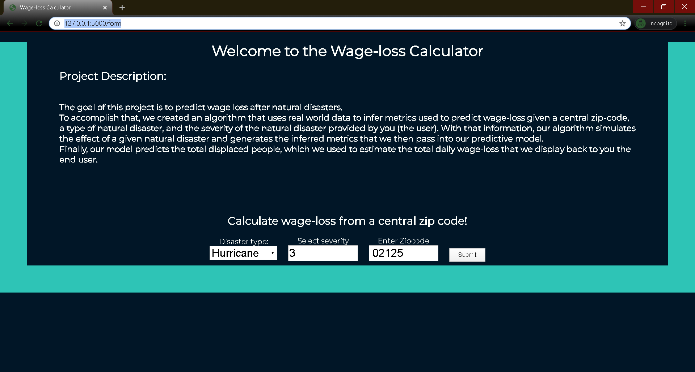
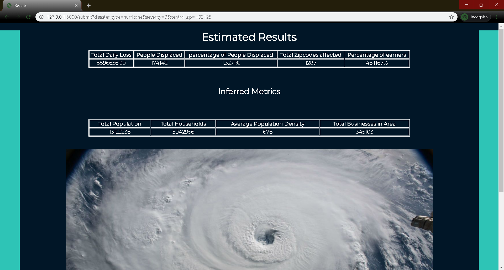

# Wage-loss Calculator (From Natural Disasters)  README

## Table of Contents
[1.0 Directory Structure](#10-Directory-Structure)<br>
[2.0 Executive Summary](#20-Executive-Summary)<br>
[3.0 Description of Data](#30-Description-of-Data)<br>
-[3.1 Size](#31-Size)<br>
-[3.2 Sources](#32-Sources)<br>
-[3.3 Data Dictionary](#33-Data-Dictionary)<br>
[4.0 Conclusion](#50-Conclusion)<br>
[5.0 Next Steps](#60-Next-Steps)<br>

## 1.0 Directory Structure

```
.
├── project_5
    ├── p5main.ipynb
    ├── natural_disaster_app.py
    ├── area_stats_methods.py
    ├── data
        ├── ACS_17_5YR_S1903
        ├── simplemaps_uszips_basicv1.7
        ├── ACS_17_5YR_S1903.zip
        ├── census.csv
        ├── census_biz.csv
        ├── hurricanes.csv
        ├── income_data.csv
        ├── individual_disasters.csv
        ├── simplemaps_uszips_basicv1.7.zip
        ├── wildfires.csv
    ├── templates
        ├── form.css
        ├── form.html
        ├── results.html
    ├── wageloss_rfr.pkl
    ├── README.md
    └── project5_slides.pdf
```

## 2.0 Executive Summary

The client, New Light Technologies, provided the following project brief describing the problem to be explored.

### Problem Statement

Use Indeed or Glassdoor together with number and type of affected businesses to estimate the expected economic loss due to a disaster.
This tool will rely on websites that provide employment information and sector-specific wage estimations (such as Glassdoor and Indeed) to project the economic loss (wage loss) due to a disaster. Based on the type of businesses and services in a given affected area and/or using supplementary demographic data (for example, from the Census Bureau of Statistics), the tool will provide an estimation about the projected economic loss in a given locality based on the reported or estimated wage loss in the locality.

### Project Goals

Project goals for this client are twofold:
- Predict lost wages resulting from natural disaster event(s).
- Deliver an interactive tool with which users can input factors and generate location-specific wage-loss estimates.

---
## Step 1 - Launch natural_disaster_app
### Step 2 - Select a disaster, it's severity, and a zip code 
<br>
### Step 3 - Observe the results for yourself
<br>


## 3.0 Description of Data

### 3.1 Size

|dataset|num. rows|num. columns|file size|
|---|---|---|---|
|census.csv|29722|18|3.73 MB|
|ACS_17_5YR_S1903_with_ann.csv|33121|243|34 MB|
|uszips.csv|33099|18|6 MB|
|income_data.csv|33099|11|2.56 MB|
|hurricanes.csv|9|8|1.58 kB|
|wildfires.csv|14|8|1.2 kB|
|census_biz.csv|33652|8|1.6 MB|
|individual_disasters.csv|20|11|57.4 kB|


### 3.2 Sources

- https://factfinder.census.gov/faces/nav/jsf/pages/index.xhtml
- https://www.internal-displacement.org/
- https://www.simplemaps.com
- https://www.fema.gov/

### 3.3 Data Dictionary

|Feature|Type|Description|
|---|---|---|
|event|object|Description of disaster|
|type|object|Type of disaster (ex. "earthquake")|
|severity|float|Severity of disaster on 1-5 scale|
|affected_zips|list|List of zip codes in the estimated affected area|
|displaced|int|Predicted # of displaced individuals (target variable)|
|damage|float|Estimated total damage in USD|
|affected_zips_count|int|Length of list in "affected_zips"|


---
## 4.0 Conclusion

Data availiability proved to be the most significant challenge in this exercise. Specifically, accessing data for the target variable, wages, in a form that would best facilitate analysis would likely require access to payroll companies' data.  Such a source would provide near-real time insight and measurement to the question of tracking and measuring wage loss as a result of a given natural disaster in a given affected area.  In lieu of such data, using the proxy of number of people displaced by a given natural disaster, in combination with census data fpr population, housing, business and wage information, etc. for given geographic locations, we are able to back into a logical estimation for the quantity in question.

However, this approach is not without significant limiations.  For starters, the size of the modeling data set contains only twenty observations - this limitation is a direct result of the fragmented way in which disaster information is collected and organized across both public and private sources.  There is no comprehensive database, no single source of truth, with regard to disaster data and the variables that are tracked and/or measured.

As a result of the various data limitations, our model suffers from bias resulting from the small size of the data set and non-random way in which it was constructed (we were forced to include disasters that are easily identifiable in order to assemble all of the inputs needed for prediction, many of which had to be manually collected from news sources, etc.).  More specifically, the disasters in the training data set are all on the larger, more catastrophic end of the spectrum, which likely is producing overestimation of the response variable, population displacement, and by extension, estimation of lost wages.

## 5.0 Next Steps

**Establish Public/Private Partnership with payroll companies** <br>
The only way to get payroll inforamtion on a week by week basis would be from a payroll company. Payroll data could be uniquely impactful for solving this problem.  Warrants exploration of possible partnerships with payroll providers (e.g. Paychex, ADP, regional providers, etc.).<br>

**Data Collection Improvement**<br>
Some of the data needed to solve this problem can be obtained via scalable means, but some critical data may need to be manually assembled. Next steps would be determining relaible ways to automate the data collection process.<br>

**General Improvements** <br>
- Build interaction features to increase the predictive capabilities or our model.
- Build out interface functionality to enable graphical input (e.g. click on map, etc.).
- Determine the optimal model via testing and optimize the peramiters and refit the the model to the new data.<br>

---
